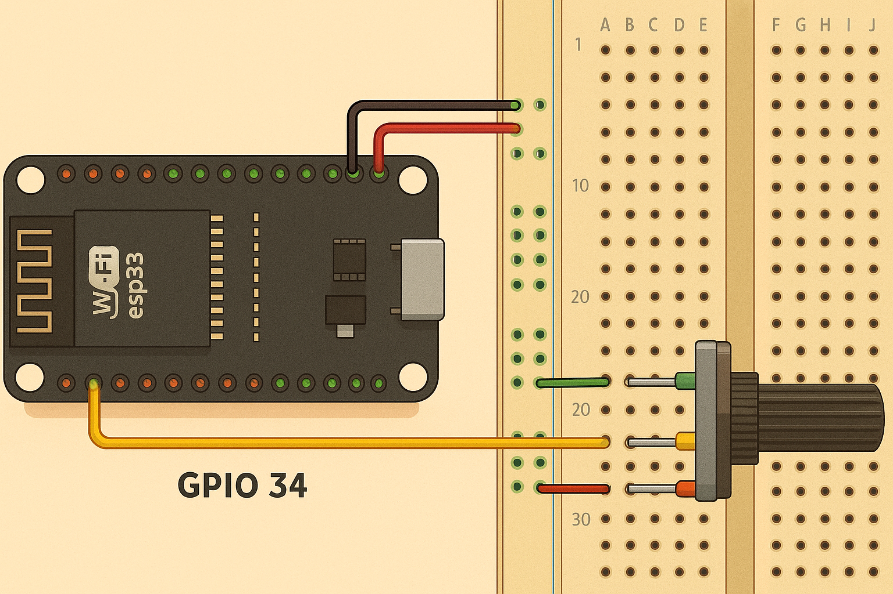
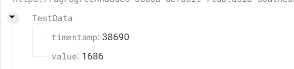

🧠 🅾🆅🅴🆁🆅🅸🅴🆆

Reads analog sensor data (0–4095 range)

Sends JSON data (timestamp + value) to Firebase

Uses WiFi + HTTP REST API (no external Firebase library needed)

Visual confirmation in Firebase console

🧰 🅷🅰🆁🅳🆆🅰🆁🅴 🆁🅴🆀🆄🅸🆁🅴🅼🅴🅽🆃🆂

Component	Quantity	Description

ESP32 Dev Board	1	Any ESP32 variant

Potentiometer	1	10kΩ linear potentiometer

Breadboard & Jumper Wires	-	For wiring

⚡ 🅲🅸🆁🅲🆄🅸🆃 🅳🅸🅰🅶🆁🅰🅼
🧩 🅱🆁🅴🅰🅳🅱🅾🅰🆁🅳 🆆🅸🆁🅸🅽🅶

Potentiometer connection to GPIO34 on ESP32:

Potentiometer Pin	Connects To

          Left (A)	3.3V
          
          Middle (Wiper)	GPIO34
          
          Right (B)	GND

📸 🅱🆁🅴🅰🅳🅱🅾🅰🆁🅳 🆅🅸🅴🆆

(Potentiometer connected to ESP32 GPIO34)

🌐 🅵🅸🆁🅴🅱🅰🆂🅴 🅳🅰🆃🅰🅱🅰🆂🅴 🆁🅴🆂🆄🅻🆃
When successfully connected, your Firebase Realtime Database will display results like this:

🧩 🅽🅾🆃🅴🆂

Make sure your Firebase Database rules allow authenticated writes.

Use your Database Secret (from Firebase → Project Settings → Service Accounts → Database Secret).

Connect 3.3V, GND, and GPIO34 exactly as shown.

You can adjust delay time or data structure as needed.

✅ 🅵🆄🆃🆄🆁🅴 🅴🅽🅷🅰🅽🅲🅴🅼🅴🅽🆃🆂

Add multiple sensor inputs (temperature, humidity, etc.)

Display real-time graphs using Firebase + React or ThingSpeak

Send data to Firestore instead of Realtime Database
